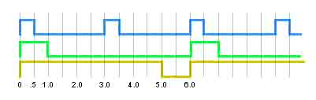

# Timer Library Experiments
<h3 align="center">A summary of my tests of various timer libraries.</h3>

Every Arduino programmer eventually runs into the problems of blocking code.  Most often from using delay().  The millis() function is the obvious solution but implementing it is messy.  There are several timer libraries in the Arduino IDE library management catalog that are intended to replace the delay() function.  I tested 10 of them here.

I also discovered another library that would accomplish the same asynchronous LED sequence, but it is not a timer library.  Details [here]

<h2>Testing criteria:</h2>
For the purposes of this test, "at the same time" means within a few instruction cycles. I don't need to be schooled that microprocessors can only do one thing at a time.

The test consisted of blinking three LEDs in asynchronous patterns.  This image illustrates the blink pattern.
All LEDs start their timing at the same time, flash asynchronously then coincidentally turn on simultaneously every six seconds.

The timers should operate independently of each other. For example, one timer starting cannot depend on another timer ending.  Using one timer to trigger another is not independent because it would not work with timers that have no repeating coincidence. Adding a more timers should have no effect overall. Five of the ten libraries tested meet this criteria.

There should be no limit to how many timers are running (within hardware or memory constraints).

In order to replace the delay() function the replacement library should be at least more straightforward than implementing millis().  All of the tested libraries fail this criteria. One spectacularly as the user needs to write a lambda in their code. Even experienced Arduino programmers are stumped by lambdas. Hardly what I would call easy to implement).

Worse, some of the timers couldn't keep time accurately over hours or days of running. One couldn't maintain accuracy for more than a few seconds.

To pass my test, the LEDS should faithfully follow the blink pattern in the image above which coincidentally repeats every six seconds.  In my discussion of the various timers, this coincidence is how I determined the accuracy of the timers. I.E., every six seconds all LEDS will turn on simultaneously.

<h3>millis()</h3>
First, I used the millis() function as a baseline.
After 48 hours the LEDs were still turning on in sync every six seconds.

[My test code](src/millis_BlinkAsync3)

<h3>AsyncDelay</h3>
This library is a series of creative macros and everything, including documentation, is in the .h file.
The constructor creates an expired timer, which means, immediately true. There is no way to pause, stop or suspend a timer and I was unable to make my async blink pattern work.

<h3>AsyncTimer</h3>
This library uses a lambda, which I don't grok. The coding is quite convoluted and the complexity kind of defeats the purpose of simplifying the use of millis(). Within minutes of starting the sketch, the LED patterns were hopelessly out of synch.

<h3>BlockNot</h3>
https://github.com/EasyG0ing1/BlockNot

This library is a recent addition to the Arduino Library Manager, so maybe still under development? This is by far one of the best documented libraries I have ever seen. It get an "A+" for documentation. This library has a NO_RESET method that stops the timer after it expires, making it a one-shot. It's the only timer library with this needed feature. BlockNot kept synchronization for 48 hours.

[My test code](src/BlockNot-BlinkAsync.ino)

<h3>GyverTimer</h3>
When you create the timer object, it starts. So, in setup you have to use the stop() function, then when ready to begin the timers, call the start() function. I give the documentation a "C". It's sparse, but mostly there.  After 48 hours running, the timers are still in sync

[My test code](src/GyverTimer-BlinkAsync.ino)

<h3>IntervalCallback</h3>
When you create the timer, it starts.  I can't create the object and then start the timer later and there is no way to change the timing period short of destroying the object and create a new one. It is pretty simple as libraries go, but the documentation is sparse and comments in the file are nonexistent. IntervalCallback does fail the criteria of independence as the only way I could sync the timers was to use one timer end to trigger another timer start.

[My test code](src/IntervalCallback_BlinkAsync.ino)

<h3>neotimer</h3>
The example sketches work, but the library generates easily fixed warnings; lazy coding.  The LEDS are still synchronized after a few hours.

[My test code](src/neoTimer-BlinkAsync.ino)

<h3>NoDelay</h3>
https://github.com/M-tech-Creations/NoDelay

This library has very good documentation in the README.md file. And a remarkably well commented .cpp file.  After 48 hours the sequences are still in sync.

[My test code](src/NoDelay-BlinkAsync.ino)

<h3>Ticker</h3>
The Arduino Ticker Library allows you to easily create Ticker callbacks, which can call a function at a predetermined interval.

[My test code](src/TickerAsync.ino)

<h3>TimeoutCallback</h3>
The library example sketches fail. I did not try to fix it.

<h3>timeObj</h3>
After only a couple of hours, the timers were out of sync. 

[My test code](src/timeObj-BlinkAsync.ino)

# ALib0.h
<h3 align="center">Strange name, but interesting library</h3>

ALib0 was mentioned on a thread in the Arduino forums in a comment by DrDiettrich.

My search led me to a fork of the original in DrDiettrich's Github site.
